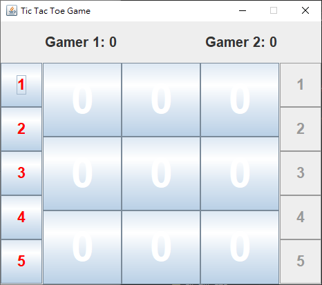

# Tic_Tac_Toe
## 專案介紹
本專案使用 Java 程式語言設計「數字井字棋遊戲」，藉此孰悉 Java 語法及物件導向觀念。

## 專案技術
Eclipse IDE for Java 2022-03

## 資料夾說明
* bin - Eclipse IDE 編譯代碼所生成之 .class 檔案放置處
* fig - 圖片放置處
* src - java 原始碼放置處

## 遊戲規則
遊戲包含 Gamer 1 （紅方） 和 Gamer 2 （藍方） 兩位玩家，第一局由 Gamer 1 先攻，兩位玩家輪流在棋盤中放入己方數字棋，己方數字棋可佔領「空地」或「小於己方數字的敵方數字棋領地」，最先以橫線、直線或斜線連成一線的玩家獲勝，勝家在下一局轉為後攻，敗家在下一局轉為先攻。若所有數字棋使用完尚未有玩家獲勝，則此局視為和局，並且在下一局維持攻守順序。

## 成果

https://github.com/Yaowun/Tic_Tac_Toe/assets/90306375/78160bc0-49e0-4b4f-bf34-4fa96305e1be
